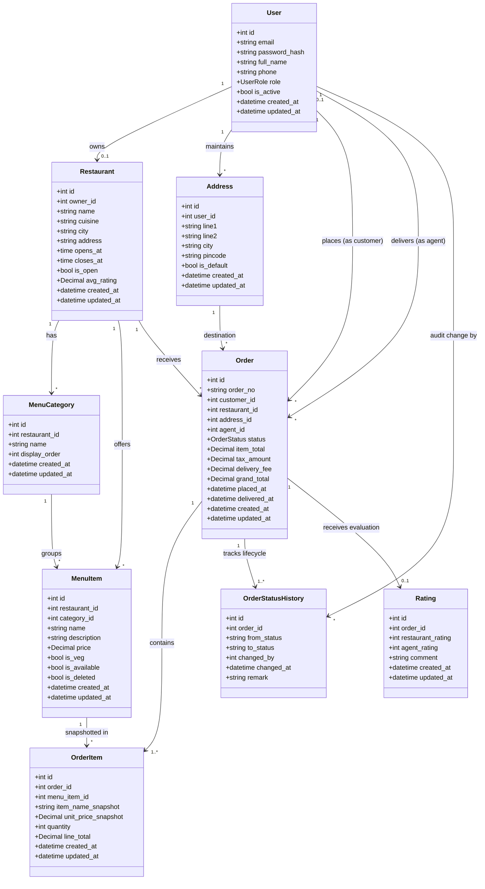

# Class Diagram

```mermaid
classDiagram
    direction TB

    class User {
        +int id
        +string email
        +string password_hash
        +string full_name
        +string phone
        +UserRole role
        +bool is_active
        +datetime created_at
        +datetime updated_at
    }

    class Restaurant {
        +int id
        +int owner_id
        +string name
        +string cuisine
        +string city
        +string address
        +time opens_at
        +time closes_at
        +bool is_open
        +Decimal avg_rating
        +datetime created_at
        +datetime updated_at
    }

    class MenuCategory {
        +int id
        +int restaurant_id
        +string name
        +int display_order
        +datetime created_at
        +datetime updated_at
    }

    class MenuItem {
        +int id
        +int restaurant_id
        +int category_id
        +string name
        +string description
        +Decimal price
        +bool is_veg
        +bool is_available
        +bool is_deleted
        +datetime created_at
        +datetime updated_at
    }

    class Address {
        +int id
        +int user_id
        +string line1
        +string line2
        +string city
        +string pincode
        +bool is_default
        +datetime created_at
        +datetime updated_at
    }

    class Order {
        +int id
        +string order_no
        +int customer_id
        +int restaurant_id
        +int address_id
        +int agent_id
        +OrderStatus status
        +Decimal item_total
        +Decimal tax_amount
        +Decimal delivery_fee
        +Decimal grand_total
        +datetime placed_at
        +datetime delivered_at
        +datetime created_at
        +datetime updated_at
    }

    class OrderItem {
        +int id
        +int order_id
        +int menu_item_id
        +string item_name_snapshot
        +Decimal unit_price_snapshot
        +int quantity
        +Decimal line_total
        +datetime created_at
        +datetime updated_at
    }

    class OrderStatusHistory {
        +int id
        +int order_id
        +string from_status
        +string to_status
        +int changed_by
        +datetime changed_at
        +string remark
    }

    class Rating {
        +int id
        +int order_id
        +int restaurant_rating
        +int agent_rating
        +string comment
        +datetime created_at
        +datetime updated_at
    }

    User "1" --> "0..1" Restaurant : owns
    User "1" --> "*" Address : maintains
    User "1" --> "*" Order : places (as customer)
    User "0..1" --> "*" Order : delivers (as agent)
    User "1" --> "*" OrderStatusHistory : audit change by

    Restaurant "1" --> "*" MenuCategory : has
    Restaurant "1" --> "*" MenuItem : offers
    Restaurant "1" --> "*" Order : receives

    MenuCategory "1" --> "*" MenuItem : groups

    Address "1" --> "*" Order : destination

    Order "1" --> "1..*" OrderItem : contains
    Order "1" --> "1..*" OrderStatusHistory : tracks lifecycle
    Order "1" --> "0..1" Rating : receives evaluation

    MenuItem "1" --> "*" OrderItem : snapshotted in
```
