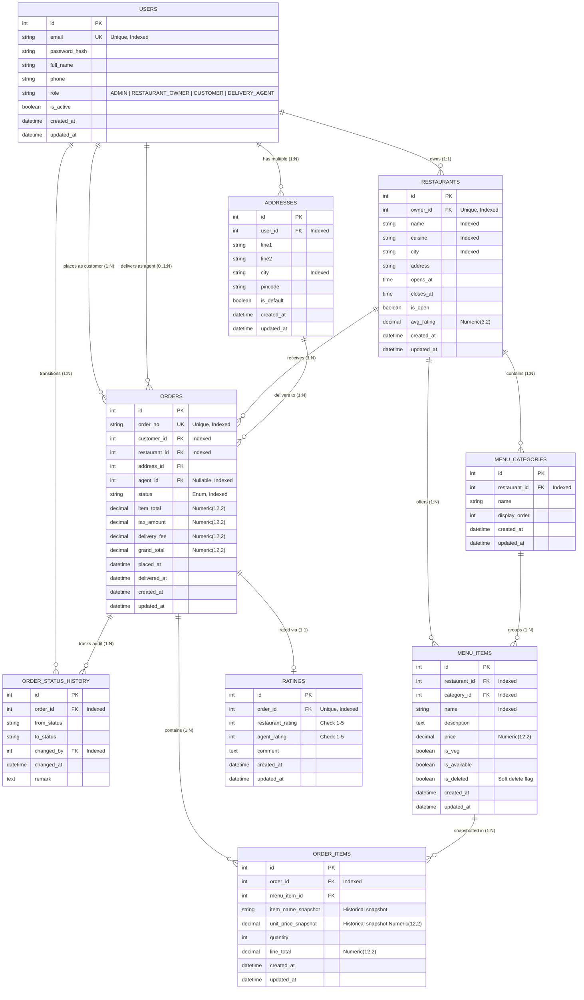

# Entity-Relationship (ER) Diagram

```mermaid
erDiagram
    USERS ||--o{ RESTAURANTS : "owns (1:1)"
    USERS ||--o{ ADDRESSES : "has multiple (1:N)"
    USERS ||--o{ ORDERS : "places as customer (1:N)"
    USERS ||--o{ ORDERS : "delivers as agent (0..1:N)"
    USERS ||--o{ ORDER_STATUS_HISTORY : "transitions (1:N)"

    RESTAURANTS ||--o{ MENU_CATEGORIES : "contains (1:N)"
    RESTAURANTS ||--o{ MENU_ITEMS : "offers (1:N)"
    RESTAURANTS ||--o{ ORDERS : "receives (1:N)"

    MENU_CATEGORIES ||--o{ MENU_ITEMS : "groups (1:N)"

    ADDRESSES ||--o{ ORDERS : "delivers to (1:N)"

    ORDERS ||--o{ ORDER_ITEMS : "contains (1:N)"
    ORDERS ||--o{ ORDER_STATUS_HISTORY : "tracks audit (1:N)"
    ORDERS ||--o| RATINGS : "rated via (1:1)"

    MENU_ITEMS ||--o{ ORDER_ITEMS : "snapshotted in (1:N)"

    USERS {
        int id PK
        string email UK "Unique, Indexed"
        string password_hash
        string full_name
        string phone
        string role "ADMIN | RESTAURANT_OWNER | CUSTOMER | DELIVERY_AGENT"
        boolean is_active
        datetime created_at
        datetime updated_at
    }

    RESTAURANTS {
        int id PK
        int owner_id FK "Unique, Indexed"
        string name "Indexed"
        string cuisine "Indexed"
        string city "Indexed"
        string address
        time opens_at
        time closes_at
        boolean is_open
        decimal avg_rating "Numeric(3,2)"
        datetime created_at
        datetime updated_at
    }

    MENU_CATEGORIES {
        int id PK
        int restaurant_id FK "Indexed"
        string name
        int display_order
        datetime created_at
        datetime updated_at
    }

    MENU_ITEMS {
        int id PK
        int restaurant_id FK "Indexed"
        int category_id FK "Indexed"
        string name "Indexed"
        text description
        decimal price "Numeric(12,2)"
        boolean is_veg
        boolean is_available
        boolean is_deleted "Soft delete flag"
        datetime created_at
        datetime updated_at
    }

    ADDRESSES {
        int id PK
        int user_id FK "Indexed"
        string line1
        string line2
        string city "Indexed"
        string pincode
        boolean is_default
        datetime created_at
        datetime updated_at
    }

    ORDERS {
        int id PK
        string order_no UK "Unique, Indexed"
        int customer_id FK "Indexed"
        int restaurant_id FK "Indexed"
        int address_id FK
        int agent_id FK "Nullable, Indexed"
        string status "Enum, Indexed"
        decimal item_total "Numeric(12,2)"
        decimal tax_amount "Numeric(12,2)"
        decimal delivery_fee "Numeric(12,2)"
        decimal grand_total "Numeric(12,2)"
        datetime placed_at
        datetime delivered_at
        datetime created_at
        datetime updated_at
    }

    ORDER_ITEMS {
        int id PK
        int order_id FK "Indexed"
        int menu_item_id FK
        string item_name_snapshot "Historical snapshot"
        decimal unit_price_snapshot "Historical snapshot Numeric(12,2)"
        int quantity
        decimal line_total "Numeric(12,2)"
        datetime created_at
        datetime updated_at
    }

    ORDER_STATUS_HISTORY {
        int id PK
        int order_id FK "Indexed"
        string from_status
        string to_status
        int changed_by FK "Indexed"
        datetime changed_at
        text remark
    }

    RATINGS {
        int id PK
        int order_id FK "Unique, Indexed"
        int restaurant_rating "Check 1-5"
        int agent_rating "Check 1-5"
        text comment
        datetime created_at
        datetime updated_at
    }
```
