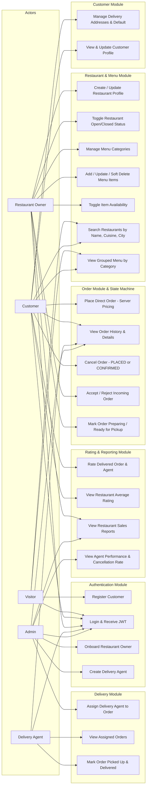

# Use Case Diagram

```mermaid
graph LR
    subgraph Users ["Actors"]
        V[Visitor]
        C[Customer]
        RO[Restaurant Owner]
        DA[Delivery Agent]
        A[Admin]
    end

    subgraph AuthModule ["Authentication Module"]
        UC1[Register Customer]
        UC2[Login & Receive JWT]
        UC3[Onboard Restaurant Owner]
        UC4[Create Delivery Agent]
    end

    subgraph RestaurantMenu ["Restaurant & Menu Module"]
        UC5[Create / Update Restaurant Profile]
        UC6[Toggle Restaurant Open/Closed Status]
        UC7[Manage Menu Categories]
        UC8[Add / Update / Soft Delete Menu Items]
        UC9[Toggle Item Availability]
        UC10[Search Restaurants by Name, Cuisine, City]
        UC11[View Grouped Menu by Category]
    end

    subgraph CustomerModule ["Customer Module"]
        UC12[Manage Delivery Addresses & Default]
        UC13[View & Update Customer Profile]
    end

    subgraph OrderModule ["Order Module & State Machine"]
        UC14[Place Direct Order - Server Pricing]
        UC15[View Order History & Details]
        UC16[Cancel Order - PLACED or CONFIRMED]
        UC17[Accept / Reject Incoming Order]
        UC18[Mark Order Preparing / Ready for Pickup]
    end

    subgraph DeliveryModule ["Delivery Module"]
        UC19[Assign Delivery Agent to Order]
        UC20[View Assigned Orders]
        UC21[Mark Order Picked Up & Delivered]
    end

    subgraph RatingReporting ["Rating & Reporting Module"]
        UC22[Rate Delivered Order & Agent]
        UC23[View Restaurant Average Rating]
        UC24[View Restaurant Sales Reports]
        UC25[View Agent Performance & Cancellation Rate]
    end

    %% Visitor Interactions
    V --> UC1
    V --> UC2
    V --> UC10
    V --> UC11

    %% Customer Interactions
    C --> UC2
    C --> UC10
    C --> UC11
    C --> UC12
    C --> UC13
    C --> UC14
    C --> UC15
    C --> UC16
    C --> UC22
    C --> UC23

    %% Restaurant Owner Interactions
    RO --> UC2
    RO --> UC5
    RO --> UC6
    RO --> UC7
    RO --> UC8
    RO --> UC9
    RO --> UC17
    RO --> UC18
    RO --> UC24

    %% Delivery Agent Interactions
    DA --> UC2
    DA --> UC15
    DA --> UC20
    DA --> UC21

    %% Admin Interactions
    A --> UC2
    A --> UC3
    A --> UC4
    A --> UC15
    A --> UC19
    A --> UC24
    A --> UC25
```
